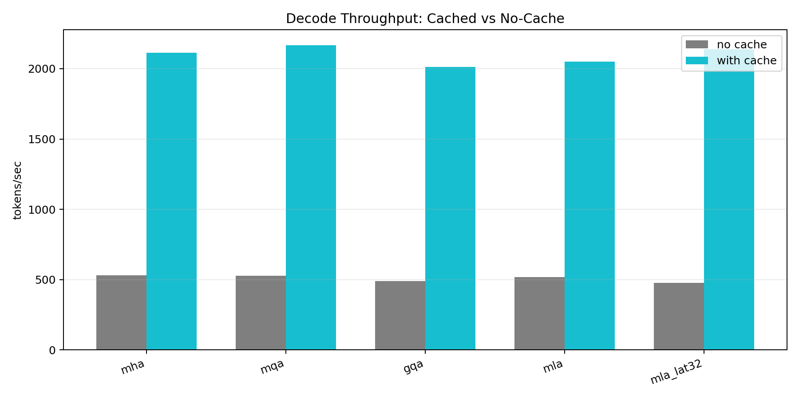
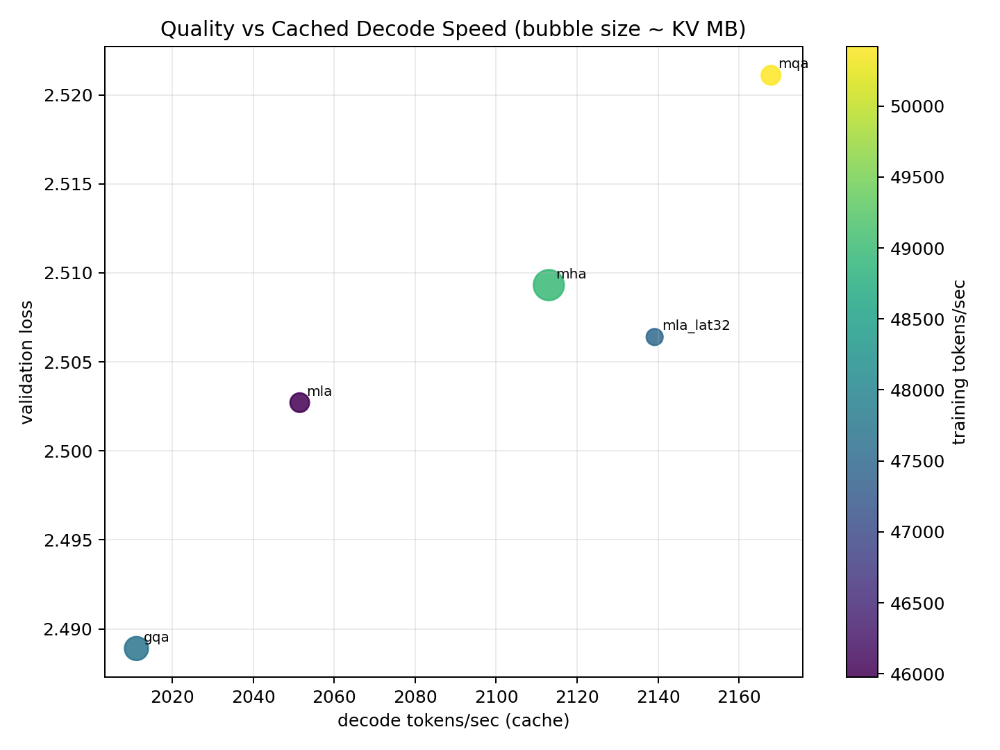
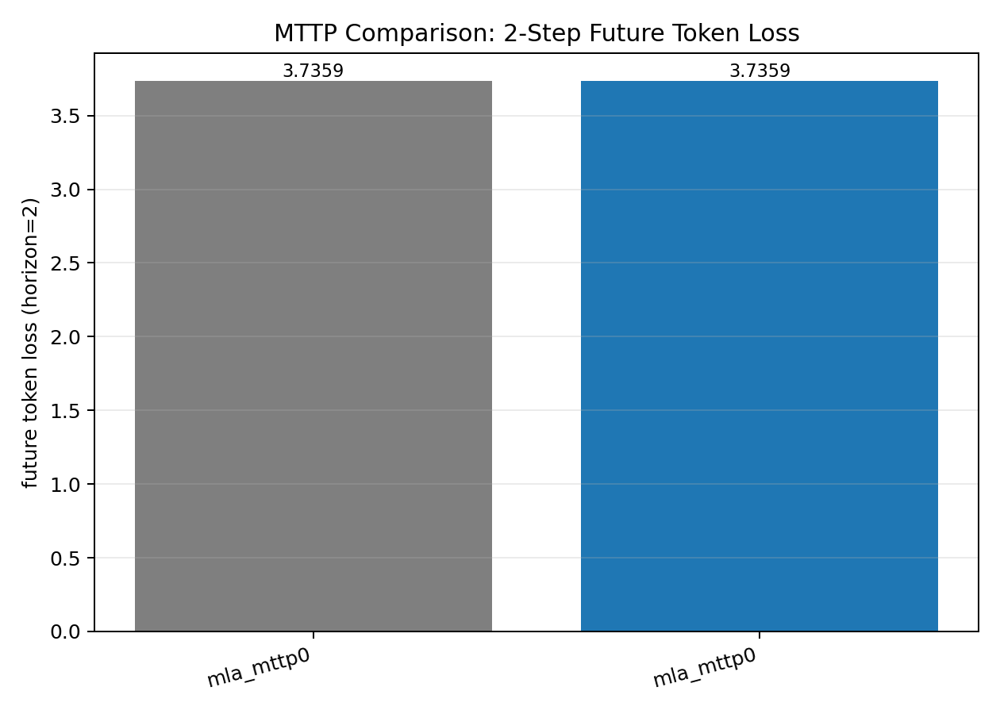
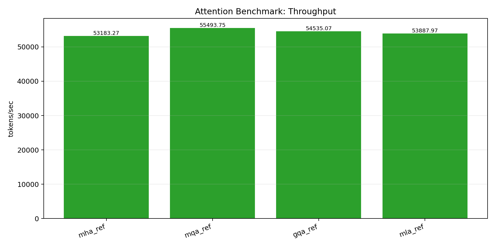
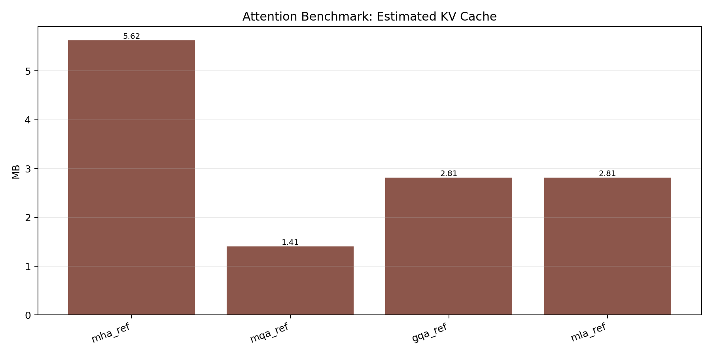

# DeepSeek-Style LLM From Scratch

This repo now includes two pipelines:
- `notebook_components.py` stack (MTTP experiments and legacy plots)
- `deepseek_llm/` stack (core model with **real KV cache** for attention/generation)

## Major Updates

- Added real KV-cache support to the core model (`deepseek_llm/`):
  - `DeepSeekLM.forward(..., past_kv=..., use_cache=True)`
  - cache-aware incremental generation in `DeepSeekLM.generate()`
- Split attention mechanisms into separate files:
  - `deepseek_llm/modules/attention_mha.py`
  - `deepseek_llm/modules/attention_mqa.py`
  - `deepseek_llm/modules/attention_gqa.py`
  - `deepseek_llm/modules/attention_mla.py`
  - shared cache/mask helpers in `deepseek_llm/modules/attention_common.py`
- Added research dataset prep:
  - `prepare_wikitext2.py` downloads **WikiText-2** and creates a small CPU-friendly subset
- Added new core efficiency benchmark + plots:
  - `benchmark_deepseek_efficiency.py`
  - `make_efficiency_plots.py`
- Ran and re-ran longer MLA training schedules:
  - `1000` steps on WikiText-2 small subset, with curated results in `assets/results/train_mla_1000_v2/metrics.json`

## Quick Setup

```bash
python3 -m venv .venv
.venv/bin/python -m pip install --upgrade pip
.venv/bin/python -m pip install torch numpy matplotlib
```

## Research Dataset (Small + CPU Efficient)

WikiText-2 (used broadly in language modeling research):

```bash
.venv/bin/python prepare_wikitext2.py \
  --out-dir data \
  --max-train-chars 320000 \
  --max-valid-chars 60000 \
  --max-test-chars 60000
```

Generated file used for training/benchmarks:
- `data/wikitext2_small_all.txt`

## MLA-Only Training Run (1000 steps)

```bash
.venv/bin/python train_deepseek.py \
  --text-path data/wikitext2_small_all.txt \
  --steps 1000 \
  --eval-interval 100 \
  --eval-iters 20 \
  --batch-size 16 \
  --block-size 96 \
  --d-model 128 \
  --n-layers 3 \
  --n-heads 4 \
  --n-kv-heads 2 \
  --attention-type mla \
  --kv-latent-dim 64 \
  --moe-num-experts 4 \
  --mttp-steps 1 \
  --mttp-coeff 0.05 \
  --out-dir assets/results/train_mla_1000_v2
```

Selected metrics from `assets/results/train_mla_1000_v2/metrics.json`:
- Initial val loss: `4.7528` (step 1)
- **Best val loss: `2.6653` at step 800**
- Final val loss: `2.6853` (step 1000)
- Improvement from step 1 to best step: `2.0875` loss points (`43.92%`)
- Peak throughput: `41422.0` tokens/sec
- Avg throughput over last 4 evals: `41363.1` tokens/sec

## Core Efficiency Benchmark (KV Cache + Attention Types)

```bash
.venv/bin/python benchmark_deepseek_efficiency.py \
  --text-path data/wikitext2_small_all.txt \
  --steps 180 \
  --batch-size 16 \
  --block-size 96 \
  --output assets/results/deepseek_efficiency.json
```

```bash
MPLCONFIGDIR="$PWD/.mplconfig" MPLBACKEND=Agg \
.venv/bin/python make_efficiency_plots.py \
  --benchmark assets/results/deepseek_efficiency.json \
  --out-dir assets/plots_efficiency
```

## Efficiency Snapshot (Core DeepSeekLM)

From `assets/results/deepseek_efficiency.json`:

| Variant | Val loss | Train tok/s | Decode tok/s (no cache) | Decode tok/s (cache) | Cache speedup | Runtime KV cache (MB) |
|---|---:|---:|---:|---:|---:|---:|
| `mha` | 2.5093 | 48977.2 | 531.5 | 2113.0 | 3.98x | 0.2813 |
| `mqa` | 2.5211 | **50418.0** | 527.4 | **2167.9** | 4.11x | 0.0703 |
| `gqa` | **2.4889** | 47687.1 | 488.5 | 2011.1 | 4.12x | 0.1406 |
| `mla` | 2.5027 | 45976.6 | 518.3 | 2051.5 | 3.96x | 0.0703 |
| `mla_lat32` | 2.5064 | 47480.8 | 477.4 | 2139.2 | **4.48x** | **0.0352** |

Takeaways:
- KV cache gives ~`4x` decode speedup across variants.
- `MLA` with lower latent (`mla_lat32`) has the smallest cache footprint.
- `GQA` is best on loss in this run, while `MQA` is best on throughput.

## Plots

### Selected best plots (recommended)

These are the most informative figures from the current run set.


### Full core efficiency plots






### Full MLA + MTTP/attention notebook plots (existing pipeline)





## Notes

- `runs/` is gitignored; tracked results/plots are saved under `assets/`.
- For stronger claims, average across multiple seeds (recommended next step).
