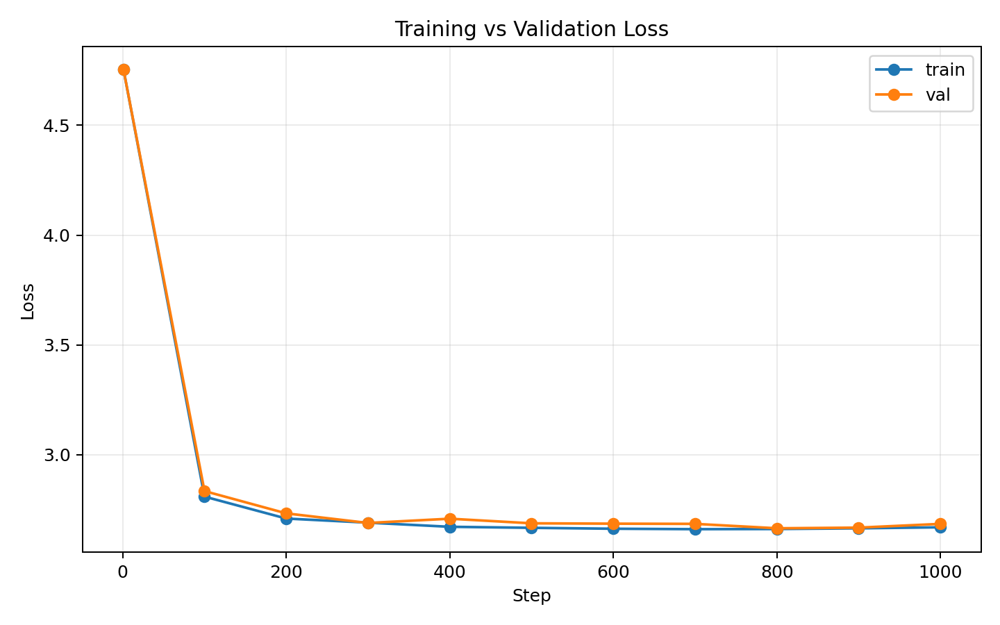
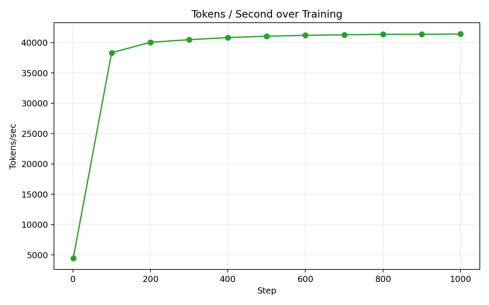
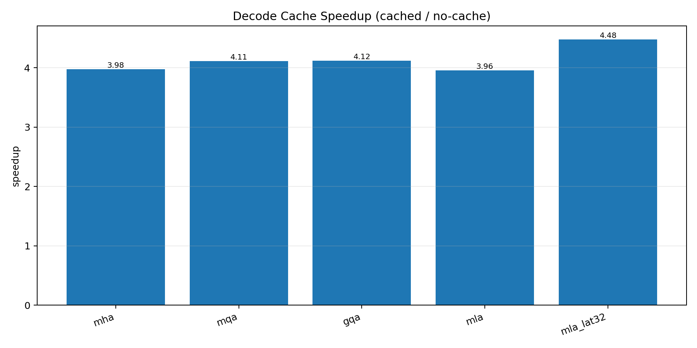
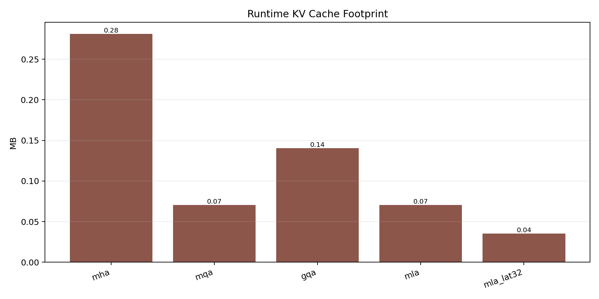
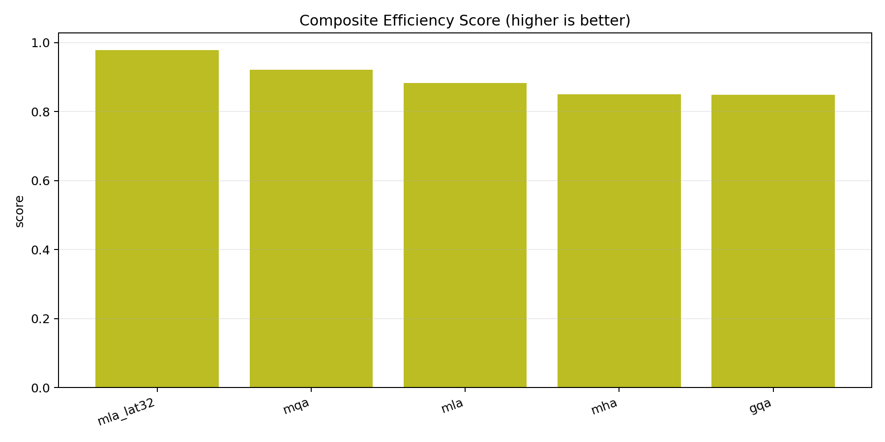

# DeepSeek-Style LLM From Scratch

Compact, reproducible DeepSeek-style language model project focused on efficient attention, MoE, and practical benchmarking on CPU-friendly research data.

## About This Project

This project has two working tracks:
- `deepseek_llm/` (core stack): modular transformer with **real KV cache** and split attention implementations (`MHA`, `MQA`, `GQA`, `MLA`)
- `notebook_components.py` (experimental stack): MTTP-focused notebook-style implementations and analysis plots

Core capabilities implemented:
- KV-cache aware decoding in `DeepSeekLM` (`past_kv`, `use_cache`)
- attention modules split by mechanism for cleaner experimentation
- MoE feed-forward routing
- MTTP auxiliary objective support in the notebook training path
- reproducible training and efficiency benchmarking pipelines

Dataset:
- **WikiText-2** subset (research-used, trimmed for fast CPU runs)
- generated file: `data/wikitext2_small_all.txt`

## Current Results (Concise)

### MLA 1000-step run

From `assets/results/train_mla_1000_v2/metrics.json`:
- best val loss: **`2.6653`** at step `800`
- final val loss: `2.6853` at step `1000`
- step 1 to best improvement: `43.92%`
- peak throughput: `41422.0` tokens/sec

### Core efficiency snapshot

From `assets/results/deepseek_efficiency.json`:
- KV cache gives roughly **~4x decode speedup** across variants
- `mla_lat32` has the smallest runtime KV footprint (`0.0352 MB`)
- in this run, `gqa` is strongest on val loss and `mqa` on throughput

## Model Showcase Plots







## Quick Start

### 1) Setup

```bash
python3 -m venv .venv
.venv/bin/python -m pip install --upgrade pip
.venv/bin/python -m pip install torch numpy matplotlib
```

### 2) Prepare WikiText-2 small subset

```bash
.venv/bin/python prepare_wikitext2.py \
  --out-dir data \
  --max-train-chars 320000 \
  --max-valid-chars 60000 \
  --max-test-chars 60000
```

### 3) Train MLA model (1000 steps)

```bash
.venv/bin/python train_deepseek.py \
  --text-path data/wikitext2_small_all.txt \
  --steps 1000 \
  --eval-interval 100 \
  --eval-iters 20 \
  --batch-size 16 \
  --block-size 96 \
  --d-model 128 \
  --n-layers 3 \
  --n-heads 4 \
  --n-kv-heads 2 \
  --attention-type mla \
  --kv-latent-dim 64 \
  --moe-num-experts 4 \
  --mttp-steps 1 \
  --mttp-coeff 0.05 \
  --out-dir assets/results/train_mla_1000_v2
```

### 4) Run efficiency benchmark + plots

```bash
.venv/bin/python benchmark_deepseek_efficiency.py \
  --text-path data/wikitext2_small_all.txt \
  --steps 180 \
  --batch-size 16 \
  --block-size 96 \
  --output assets/results/deepseek_efficiency.json
```

```bash
MPLCONFIGDIR="$PWD/.mplconfig" MPLBACKEND=Agg \
.venv/bin/python make_efficiency_plots.py \
  --benchmark assets/results/deepseek_efficiency.json \
  --out-dir assets/plots_efficiency
```
